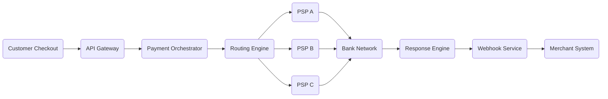
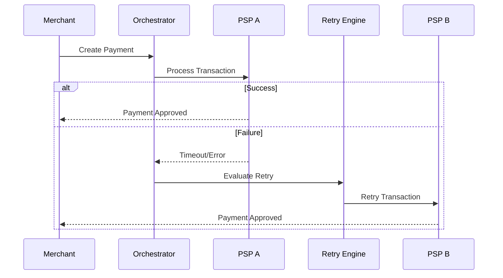

# Intelligent Payment Routing

A Technical Product Management case study for a payment orchestration platform that dynamically routes transactions across multiple payment service providers to improve approval rates, reduce cost, and increase reliability.

---

# Overview

Modern merchants process transactions across multiple payment providers, banks, and geographies. Static payment routing often leads to:

- Lower authorization rates
- Higher transaction failures
- Increased payment processing costs
- Poor customer experience
- Revenue loss during provider outages

This project explores how an Intelligent Payment Routing platform can dynamically optimize payment flows using real-time performance signals, retry mechanisms, and adaptive routing strategies.

The focus of this repository is to demonstrate:
- Product thinking
- Payment orchestration concepts
- Platform architecture design
- Reliability engineering
- API-driven systems
- AI optimization opportunities
- Technical Product Management capabilities

---

# Repository Structure

```bash
intelligent-payment-routing/
├── README.md
├── product/
│   ├── prd.md
│   ├── user-personas.md
│   ├── problem-statement.md
│   ├── product-strategy.md
│   ├── roadmap.md
│   └── success-metrics.md
├── architecture/
│   ├── system-design.md
│   ├── routing-engine.md
│   ├── api-contracts.md
│   ├── data-model.md
│   ├── retry-and-failover.md
│   └── scalability.md
├── analytics/
│   ├── kpi-dashboard.md
│   ├── approval-rate-analysis.md
│   ├── cost-optimization.md
│   └── experiment-plan.md
├── operations/
│   ├── rollout-plan.md
│   ├── launch-checklist.md
│   ├── incident-playbook.md
│   ├── risk-register.md
│   └── sla-slo.md
├── ai-routing/
│   ├── adaptive-routing.md
│   ├── risk-scoring.md
│   └── ml-opportunities.md
├── diagrams/
│   ├── system-architecture.png
│   ├── routing-flow.png
│   └── failover-flow.png
└── demo/
    ├── sample-routing-rules.json
    └── routing-simulation.md
```

---

# Problem Statement

Global merchants lose significant revenue due to:

- Failed payment authorizations
- PSP outages
- Static routing logic
- Poor retry mechanisms
- Limited operational visibility

Most payment systems rely on fixed routing rules and cannot dynamically adapt to:

- Geography
- Issuer behavior
- PSP degradation
- Fraud signals
- Latency spikes
- Currency optimization

As transaction scale increases, payment resiliency and intelligent routing become critical platform capabilities.

---

# Product Goals

The platform aims to:

- Improve authorization rates by 8–12%
- Reduce payment processing cost
- Minimize failed transactions
- Improve payment reliability
- Reduce latency
- Enable intelligent failover
- Improve merchant experience
- Provide real-time operational visibility

---

# Core Features

## Dynamic Routing

Transactions are routed dynamically using:

- Geography
- Currency
- BIN intelligence
- PSP health score
- Latency
- Cost optimization
- Fraud and risk signals

---

## Smart Retry Engine

Failed transactions are automatically retried through alternate PSPs using configurable retry logic.

Key capabilities:
- Retry orchestration
- Duplicate protection
- Intelligent retry timing
- Retry recovery tracking

---

## PSP Health Monitoring

The platform continuously monitors:

- Approval rates
- Latency
- Downtime
- Error spikes
- Throughput
- Regional degradation

This enables proactive traffic shifting and failover handling.

---

## Cost Optimization

The routing engine balances:
- Approval rate
- Processing cost
- Latency
- Reliability

to optimize overall transaction efficiency.

---

## Risk-Aware Routing

Risk signals and fraud scores can influence routing decisions to reduce fraud exposure and improve authorization outcomes.

---

## Real-Time Analytics Dashboard

Operational dashboards track:

- Approval rate
- Retry recovery
- Revenue recovery
- PSP performance
- Failure trends
- Latency distribution
- Transaction success by region

---

# System Architecture

```text
Merchant
   ↓
API Gateway
   ↓
Payment Orchestrator
   ↓
Routing Engine
   ↓
PSP Connectors
   ↓
Payment Providers
```

Supporting systems include:

- Retry Service
- Fraud Engine
- Monitoring Layer
- Event Bus
- Analytics Pipeline
- Notification Service

---

# Routing Logic Example

| Condition | Route |
|---|---|
| India + UPI | PSP A |
| US + Visa | PSP B |
| High-risk transaction | PSP C |
| PSP outage | Failover PSP |
| Retry attempt | Alternate provider |

---

# Routing Flow



---

# Retry and Failover Flow



---

# API Contract Example

## Route Payment API

```json
POST /route-payment

{
  "merchant_id": "M123",
  "amount": 100,
  "currency": "USD",
  "country": "US",
  "payment_method": "card"
}
```

## Sample Response

```json
{
  "route": "PSP_B",
  "estimated_latency_ms": 120,
  "risk_score": 0.12
}
```

---

# Product Tradeoffs

| Decision | Benefit | Tradeoff |
|---|---|---|
| Multi-PSP routing | Higher success rates | Increased complexity |
| Retry engine | Revenue recovery | Duplicate handling risk |
| AI-based routing | Better optimization | Model maintenance |
| Async webhooks | Scalability | Event consistency challenges |
| Global failover | High resiliency | Operational overhead |

---

# Key Metrics

| Metric | Purpose |
|---|---|
| Authorization Rate | Revenue optimization |
| Retry Recovery Rate | Failure recovery |
| P95 Latency | Performance monitoring |
| Cost per Transaction | Margin optimization |
| PSP Health Score | Reliability tracking |
| Revenue Recovery | Retry effectiveness |

---

# Observability & Monitoring

Key operational metrics include:

- Gateway uptime
- Approval success rate
- Retry recovery rate
- Webhook latency
- API response time
- Failure distribution
- Transaction traceability

Example monitoring stack:
- Prometheus
- Grafana
- OpenTelemetry

---

# Scalability Considerations

The platform is designed using:
- Event-driven architecture
- Stateless routing services
- Kafka-based streaming
- Distributed caching
- Multi-region deployment
- Horizontal scaling
- Circuit breakers
- Rate limiting

---

# Failure Handling

## PSP Timeout

- Trigger failover
- Retry through backup PSP

---

## Provider Outage

- Activate circuit breaker
- Shift traffic dynamically

---

## Retry Storm

- Enable degraded mode
- Reduce retry frequency
- Activate throttling

---

# AI Optimization Opportunities

## Approval Probability Prediction

Predict the highest-success PSP before routing.

---

## Predictive Failover

Detect PSP degradation before outages occur.

---

## Smart Retry Timing

Optimize retry intervals dynamically using historical transaction patterns.

---

## Reinforcement Learning Routing

Continuously improve routing decisions using real-time transaction feedback loops.

---

# Rollout Strategy

## Phase 1 — Internal Testing

- Sandbox integrations
- Routing simulations
- Performance validation

---

## Phase 2 — Pilot Rollout

- Limited merchants
- Observe approval rates
- Validate failover handling

---

## Phase 3 — Regional Expansion

- Geography-based rollout
- Enable adaptive routing

---

## Phase 4 — Global Deployment

- Full traffic migration
- AI optimization enabled

---

# Incident Management

## Severity Levels

| Severity | Description |
|---|---|
| SEV1 | Global outage |
| SEV2 | Major degradation |
| SEV3 | Minor routing issue |

---

## Incident Workflow

1. Detect issue
2. Trigger alerts
3. Shift traffic
4. Notify stakeholders
5. Restore service
6. Conduct RCA

---

# Example Routing Rules

```json
{
  "routing_rules": [
    {
      "country": "IN",
      "method": "UPI",
      "route_to": "PSP_A"
    },
    {
      "country": "US",
      "card_type": "VISA",
      "route_to": "PSP_B"
    },
    {
      "risk_score_gt": 0.8,
      "route_to": "PSP_C"
    }
  ]
}
```

---

# Why Payment Orchestration Matters

As payment scale increases, relying on a single payment provider introduces:

- Authorization risk
- Regional failures
- Uptime dependency
- Operational limitations
- Scalability challenges

Payment orchestration improves:
- Transaction success rates
- Resiliency
- Routing flexibility
- Global payment expansion
- Merchant control
- Revenue recovery

---

# Future Enhancements

- AI-powered routing
- Merchant-configurable routing
- Fraud-aware optimization
- Cost prediction models
- Real-time traffic shaping
- Adaptive retries
- Self-healing failover systems

---

# Learning Outcomes

This project demonstrates:
- Payment systems understanding
- Technical Product Management
- Platform product thinking
- API architecture concepts
- Reliability engineering
- Operational scalability
- AI-driven optimization opportunities

---

# Author

Ankit Phartiyal

Technical Product Manager  
Fintech | Payments | APIs | Platform Products | AI Product Strategy
